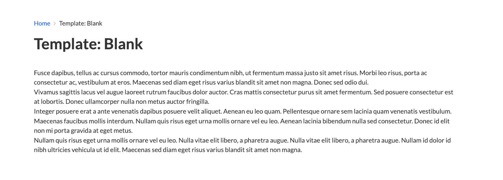
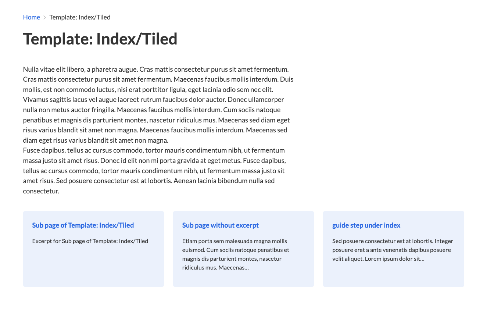
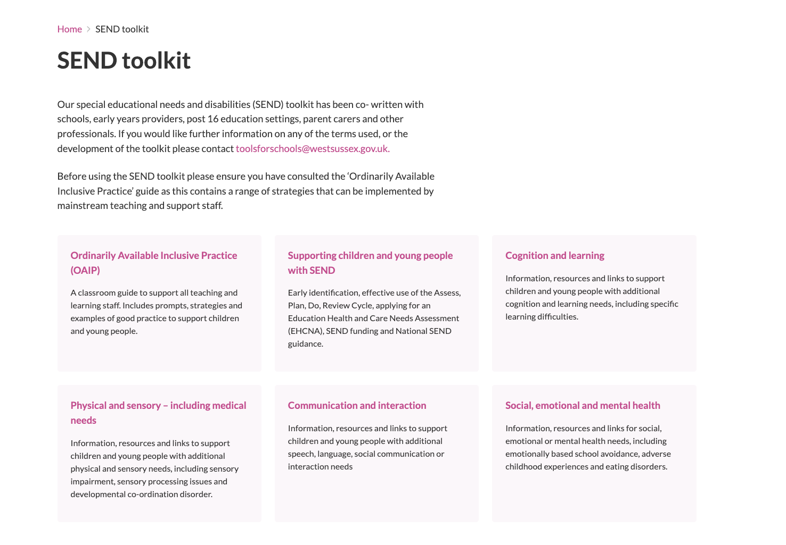
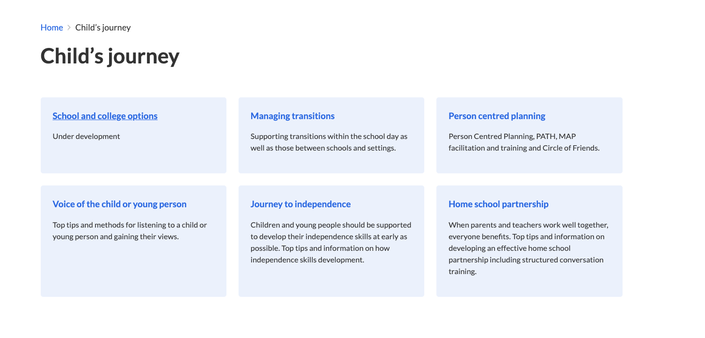
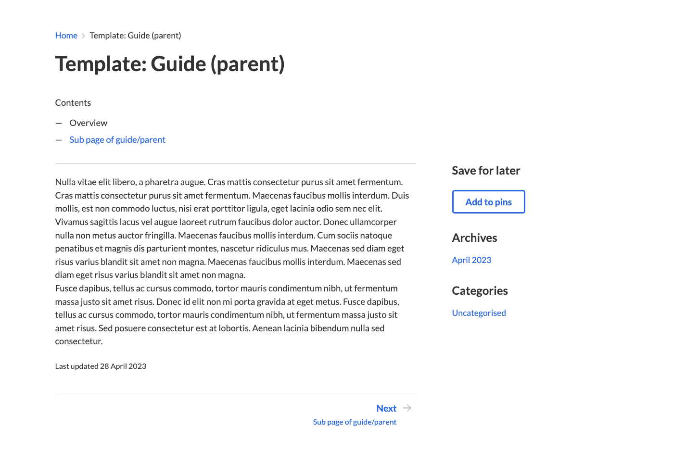
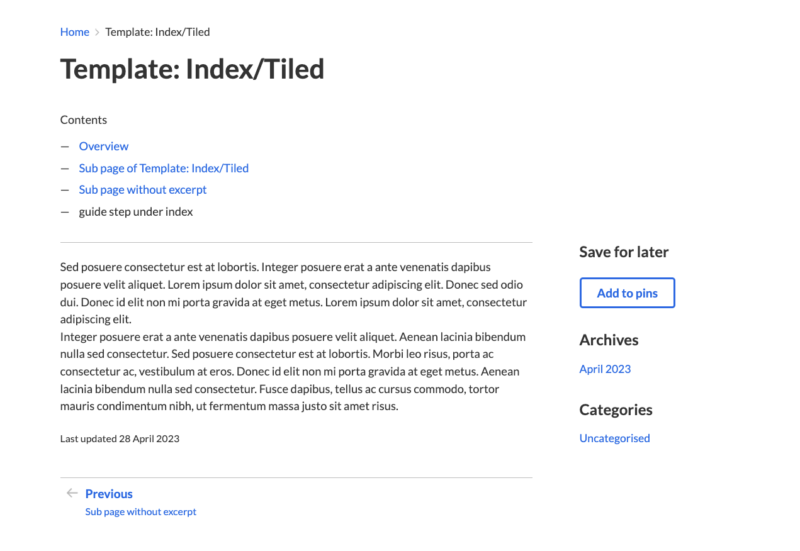
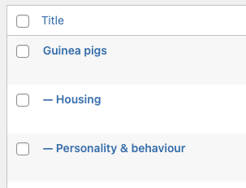
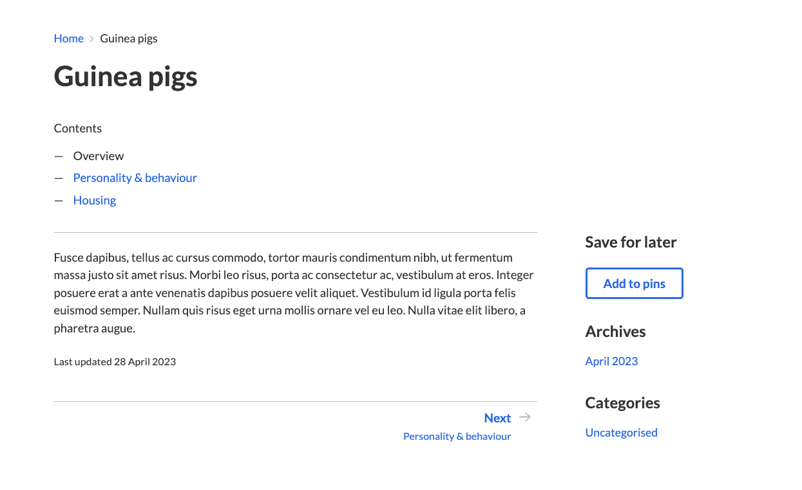
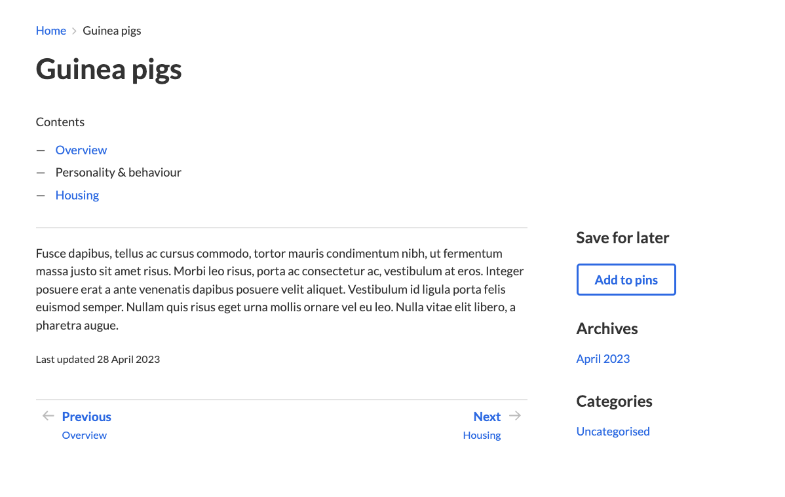
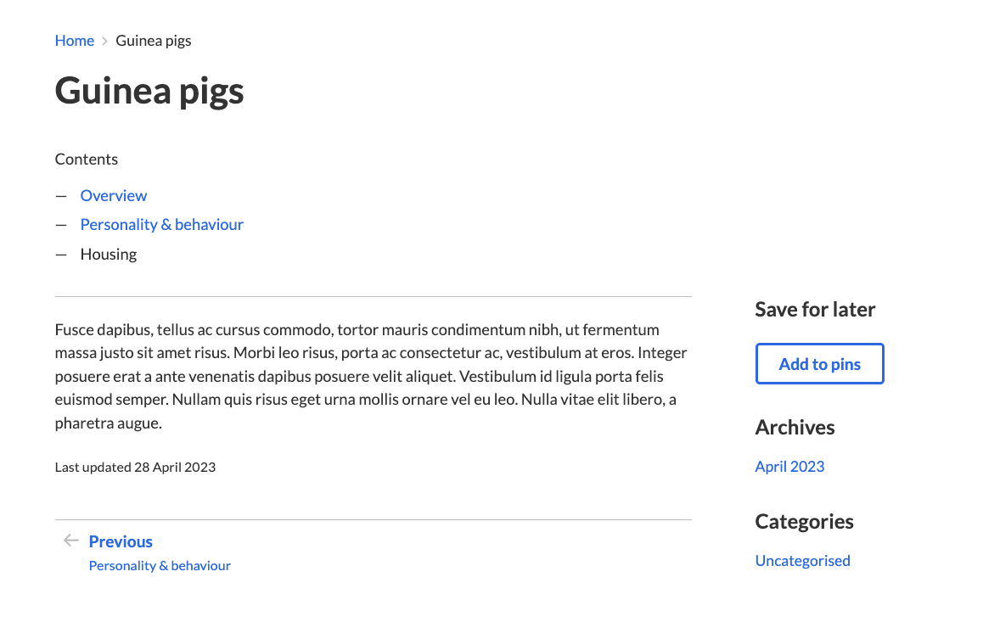

# West Sussex local offer WP theme

WordPress theme for the West Sussex local offer.

## Developing locally

You need a Wordpress website up and running. Clone this repo into the `wp-content/themes` folder.

Then, activate it through the WP admin dashboard.

To make changes to JS and SCSS files you'll need to start up the [Parcel](https://parceljs.org) bundler and Gulp:

```
npm i
npm run dev
```

It will watch for changes.

You can use moden JavaScript syntax (including JSX) and any imports supported by Parcel.

## Using it in production

Make sure that you run `npm run build` to create production JS and SCSS before deploying it to a live site.

## Wordpress settings

Permalink structure: `/blog/%year%/%monthnum%/%day%/%postname%/`

## Wordpress site structure and functionality

This theme is the parent theme for two sites, tools for schools and west sussex local offer information. (previously included in local-offer.org/information)

### Javascript & CSS

are built using parcel + gulp.

### Content editor templates

**Blank** - full page no sidebar

- Use this for full page content.



**Index/Tiled** - Content with coloured boxes underneath

- Leave content area empty for a series of tiles.
- Has no sidebar content.
- Can be applied to subpages too





**Guide (parent)** - Page where prev/next and content list are from subpages

- This template displays any pages nested underneath it within the contents block at the top.
- It navigates backwards and forwards within the sub pages as well



**Guide step (child)** - Page where prev/next and content list are from same level

- The content list and prev/next come from pages in the same level as the page this template is assigned to



### Site functionality templates

**Pinboard** - use for the /pins page

- You will only need to use this page once, this is for creating the /pins page


### How to use the guide step templates

A page structure like the following:



in wordpress pages view:

```
- Homepage
- Guinea pigs - template: Guide step (parent) url: /guinea-pigs
  - Housing - template: Guide step (child)  url: /guinea-pigs/housing
  - Personality & behaviour - template: Guide step (child)  url: /guinea-pigs/personality-behaviour/
```

Will give you the following pages:




